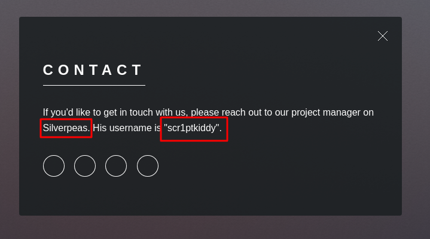
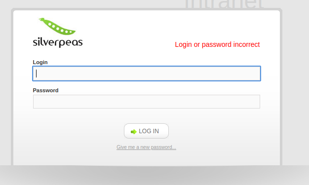

# 🧠 SilverPlatter  
**By Allante Johnson**

---

## 🧭 Overview
This walkthrough documents the full exploitation path of the **SilverPlatter** machine, including **enumeration**, **web exploitation**, **IDOR vulnerability abuse**, **SSH access**, and **privilege escalation** to root.  
Each step includes commands, findings, and screenshots for validation.

---

## 🔍 Enumeration

### Nmap Syntax
```bash
nmap -p- [Target IP] -v -T5
nmap -p [Open Ports] -A [Target IP] -v -T5
```

### Nmap Results
```bash
PORT     STATE SERVICE    VERSION
22/tcp   open  ssh        OpenSSH 8.9p1 Ubuntu 3ubuntu0.4 (Ubuntu Linux; protocol 2.0)
80/tcp   open  http       nginx 1.18.0 (Ubuntu)
8080/tcp open  http-proxy
```

---

## 🌐 Web App Enumeration

### HTTP (80)
Ran `dirsearch` to identify accessible directories:
```bash
dirsearch -u 10.10.84.136
```

### 🧭 Virtual Host Discovery (VHosts)
```bash
./vhost-fuzzer.sh 10.10.84.136 /usr/share/wordlists/dirbuster/directory-list-2.3-medium.txt http://10.10.84.136 14124
```

### Website Screenshot


🟢 **Software Identified:** Silverpeas  
🧑 **Username Discovered:** `scr1ptkiddy`

---

## ⚙️ Service on Port 8080
Accessed login portal:
```
http://10.10.84.136:8080/silverpeas/defaultLogin.jsp
```


---

## 🔐 Credential Brute Force / Password Spraying
Generated custom password list with `cewl` and used Burp Suite Turbo Intruder.

.png)

🟢 Valid credentials:
```
Username: scr1ptkiddy
Password: adipiscing
```

.png)

---

## 📨 IDOR Vulnerability – Credential Disclosure
.png)

🧾 Credentials leaked:
```
Username: tim
Password: cm0nt!md0ntf0rg3tth!spa$$w0rdagainlol
```

---

## 💻 SSH Access
```bash
ssh tim@10.10.164.112
```

.png)

### 🧾 User Flag
```bash
cat user.txt
THM{c4ca4238a0b923820dcc509a6f75849b}
```
.png)

---

## 📈 Privilege Escalation Enumeration
User in `adm` group can read `/var/log`.

Found DB password in logs:  
.png)

```
DB_PASSWORD=_Zd_zx7N823/
```

Switched to Tyler:  
.png)

---

## 🧠 Root Privilege Escalation
Checked sudo privileges and escalated:
```bash
sudo su
cd /root && cat root.txt
THM{098f6bcd4621d373cade4e832627b4f6}
```
.png)

---

## ✅ Summary
| Step | Action | Result |
|------|--------|---------|
| Recon | Nmap | Found ports 22, 80, 8080 |
| Web Enum | Dirsearch + VHosts | Found Silverpeas |
| Exploitation | IDOR | Gained SSH access |
| PrivEsc | adm logs | Found DB creds |
| Root | Sudo | Got root flag |

---

## 🧠 Lessons Learned
- Always inspect `/var/log/` when user is in `adm` group.
- Look for credential reuse.
- Web apps may expose sensitive data via IDOR.

---

## 📂 Repository Info
**Repository Name:** `SilverPlatter`  
**Status:** ✅ Completed  
**Type:** TryHackMe Walkthrough
